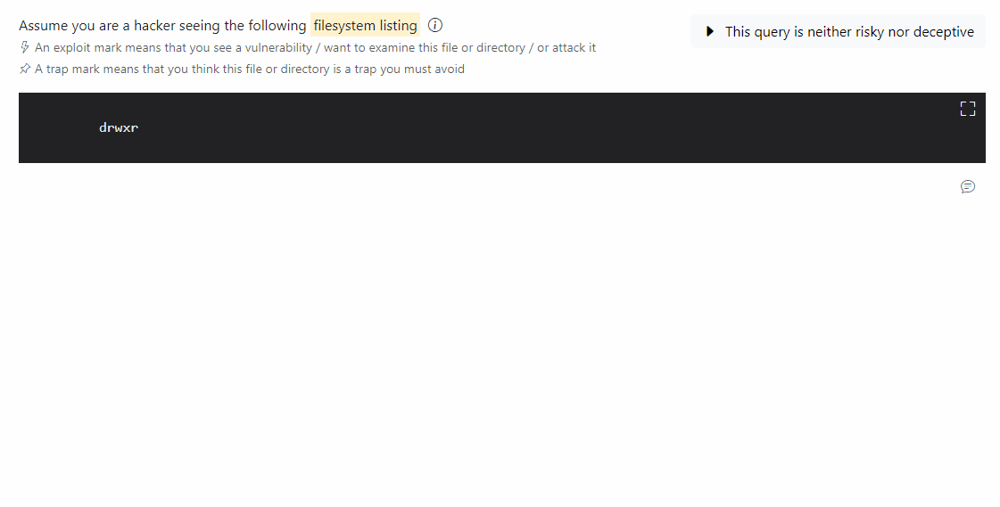
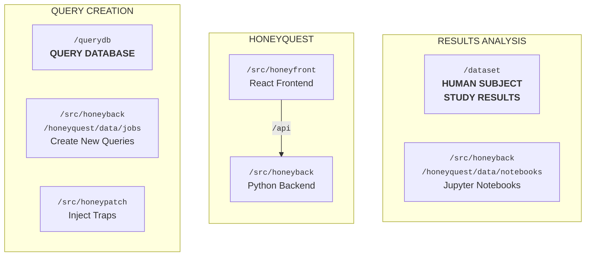

<!-- markdownlint-disable no-inline-html first-line-h1 -->

<p align="center">
  
</p>

# Honeyquest

Honeyquest is a cyber security game that asks humans to distinguish neutral, risky, and deceptive payloads.
Honeyquest presents participants with realistic web application vignettes ("queries").
Participants are asked to think like a hacker and tell us their next move.

Honeyquest can be used to evaluate what vulnerabilities and cyber traps are most attractive to attackers.

- 🚀 **Demo** — [honeyquest.cns.research.dynatracelabs.com](https://honeyquest.cns.research.dynatracelabs.com)
<!-- - 📜 **Paper** — [Honeyquest: Rapidly Measuring the Enticingness of Cyber Deception Techniques with Code-based Questionnaires](https://doi.org/10.1145/3678890.3678897) -->



## 🐳 Quickstart

Use the Docker image to start Honeyquest.
Append the `--help` argument to see all available options.

```sh
docker run -p 3000:3000 ghcr.io/dynatrace-oss/honeyquest -u https://raw.githubusercontent.com/dynatrace-oss/honeyquest/main/.github/hostedfiles/querydb.tar.gz
```

Then, navigate to 🌍 [localhost:3000](http://localhost:3000) in your browser.

## 📦 Project Structure

- 🚀 Want to **TRY OUT** Honeyquest? Visit our live demo at [honeyquest.cns.research.dynatracelabs.com](https://honeyquest.cns.research.dynatracelabs.com) today.
- 📊 Want to **ANALYZE** the results from our human subject experiment? Navigate to the 📂 [`./dataset`](./dataset) directory.
- 🎨 Want to **CREATE** your own query database? Start with the 📄 [QUERY_DATABASE](./docs/QUERY_DATABASE.md) document.
- 💻 Want to **DEVELOP** the Honeyquest application locally? Follow the [Developer Guide](#-developer-guide) below.
- ☁️ Want to **DEPLOY** Honeyquest to AWS? Refer to the 📄 [DEPLOYMENT](./docs/DEPLOYMENT.md) document.
- ⚖️ Want to **CITE** Honeyquest, our datasets, or our paper? Head to the [License and Attribution](#%EF%B8%8F-license-and-attribution) section.

Honeyquest needs a query database to run. The query database contains the questions that are presented to the users.
Our queries are stored in the 📂 [`./querydb`](./querydb) directory. You can also create your own queries.
Queries are just YAML files with a specific structure that is described in the 📄 [QUERY_DATABASE](./docs/QUERY_DATABASE.md) document.
To automate the creation of queries, we also provide a few [Dagster](https://dagster.io/) jobs
which are described in the 📄 [QUERY_CREATION](./docs/QUERY_CREATION.md) document.
Some queries are created by "patching" existing queries with our separate 📂 [`./src/honeypatch`](./src/honeypatch) tool.
Find a bit of information about Honeypatch in the 📄 [HONEYPATCH](./docs/HONEYPATCH.md) document.

The Honeyquest application consists of a frontend and a backend process.
The frontend is a React application that serves the user interface.
The backend is a Python application that exposes a REST API with FastAPI and does all the heavy lifting.
Our Docker container bundles both the frontend and the backend into a single container for easy deployment.

During our study we ran a human subject experiment with 47 participants,
who submitted a total of 3,669 responses to our queries (and placed 6,659 individual marks).
We dataset is freely available for further research and analysis.
The dataset and a description of it is stored in the 📂 [`./dataset`](./dataset/README.md) directory.
Also, we provide a few Jupyter notebooks and Python scripts that we used to analyze the results in the
📂 [`./src/honeyback/honeyquest/data/notebooks`](./src/honeyback/honeyquest/data/notebooks) directory.



## 💻 Developer Guide

Planning to make changes to the source code or just want to run Honeyquest locally? Read on.

### Prerequisites

You need the following toolchain installed:

- [Node.js 20](https://nodejs.org/en/download/) for the frontend app
- [Python 3.10](https://www.python.org/downloads/) for the backend API
- [Poetry](https://python-poetry.org/docs/#installation) for Python dependency management
- [pre-commit](https://pre-commit.com/#install) for the pre-commit hooks

First, install Honeyfront (frontend for Honeyquest) dependencies.

```sh
cd ./src/honeyfront
npm install
```

Then, install Honeyback (backend for Honeyquest) dependencies.
Backend dependencies are split into multiple groups:

- `main` covers everything for Honeyquest and Dagster to run
- `hooks` (optional) contains pre-commit hooks, linters, formatters, and type checkers
- `analytics` (optional) contains packages to analyze the data and create figures
- `docker` (optional) contains a process manager needed only inside the Docker container

```sh
cd ./src/honeyback
poetry shell
poetry install --with hooks,analytics
```

Then, install Honeypatch dependencies.
Note that this is a separate Poetry environment.

```sh
cd ./src/honeypatch
poetry shell
poetry install
```

Then, back in the root directory, install the pre-commit hooks.

```sh
pre-commit install
```

### Start Honeyquest

The backend exposes a REST API to serve the queries.
Don't forget to specify the folder that holds the query database.
For more options, take a look at the CLI help or head to the [Configuration](#%EF%B8%8F-configuration) section.
Start the backend API with the following command:

```sh
cd ./src/honeyback
poetry run honeyquest --data ../../querydb
```

The frontend serves the user interface.
During development, Vite will transparently proxy requests to `/api` to the backend REST API.
During production, an NGINX server in the Docker container will route these requests instead.
Start the frontend with the following command:

```sh
cd ./src/honeyfront
npm run dev
```

Then, navigate to 🌍 [localhost:3000](http://localhost:3000) in your browser.

Answers from users are stored in a tempory directory that is printed to the console.
Refer to the [Configuration](#%EF%B8%8F-configuration) section to specify a different location.

### Start Honeypatch

Honeypatch is stand-alone tool to inject traps into arbitrary, text-based payload.
Start the program and read the help message.

```sh
cd ./src/honeypatch
poetry run honeypatch --help
```

For more usage instructions, refer to the 📄 [HONEYPATCH.md](./docs/HONEYPATCH.md) document.

## ⚙️ Configuration

### Configure the query database

The backend API needs to be told where to find the query database.
The query database contains the questions that are presented to the users.

The easiest way is to tell Honeyquest to download a `.tar.gz` compressed dataset from a public URL
and extract it on the fly with the `--data-url` argument (or the `HONEYQUEST_DATA_URL` environment variable).
The following command downloads our query database from GitHub and starts the backend:

```sh
honeyquest --data-url https://raw.githubusercontent.com/dynatrace-oss/honeyquest/main/.github/hostedfiles/querydb.tar.gz
```

You can also pass the `--data` argument (or the `HONEYQUEST_DATA` environment variable)
to the CLI with the path to the query database. The following command uses our query database and starts the backend:

```sh
honeyquest --data ./querydb
```

If you want to create your own query database, refer to the 📄 [QUERY_DATABASE.md](./docs/QUERY_DATABASE.md) document.

### List of available arguments and environment variables

| Environment Variable                            | CLI Argument         | Description                                          | Default      |
| ----------------------------------------------- | -------------------- | ---------------------------------------------------- | ------------ |
| `HONEYQUEST_DATA` _(required)_ <sup>1</sup>     | `-d` or `--data`     | Directory with the query database                    | not set      |
| `HONEYQUEST_DATA_URL` _(required)_ <sup>1</sup> | `-u` or `--data-url` | URL with the query database as a `.tar.gz` file      | not set      |
| `HONEYQUEST_RESULTS`                            | `-r` or `--results`  | Directory for user profiles, responses, and feedback | temporary    |
| `HONEYQUEST_INDEX`                              | `-i` or `--index`    | Name of the query index <sup>2</sup>                 | `main`       |
| `ADMIN_TOKEN` _(recommended)_                   | `--admin-token`      | Token for the admin panel                            | random token |
| `COOKIE_SECRET` _(recommended)_                 | `--cookie-secret`    | Secret to sign session cookies <sup>3</sup>          | random token |
| `COMPRESS_RESULTS`                              | `--compress`         | Compress results with gzip                           | `false`      |
| `SAMPLE_DUPLICATES`                             | `--duplicates`       | Sample duplicate queries <sup>4</sup>                | `false`      |
| `COOKIE_EXPIRE_DAYS`                            |                      | Maximum age of the browser cookie                    | `365`        |
| `SESSION_TIMEOUT_MINS`                          |                      | Clusters user responses in multiple (session) files  | `60`         |
| `API_BURST_LIMIT`                               |                      | Capacity of the leaky bucket for rate limiting       | `10`         |
| `API_RATE_LIMIT`                                |                      | Refill rate of the leaky bucket for rate limiting    | `1`          |
|                                                 | `--debug`            | Enable development mode                              | `false`      |
|                                                 | `--help`             | Shows the help text on the console                   |              |

<sup>1</sup> You must set only one of `HONEYQUEST_DATA` or `HONEYQUEST_DATA_URL` to start Honeyquest, not both.

<sup>2</sup> The query database not only contains the questions but also one or more query indices.
Query indices define what questions are shown to the user, and in what order.
This argument allows to select a different index from the query database. If not set, the default index `main` is used.
If no `main` index is found, but there is only one index, that index is used. Otherwise, an error is thrown.
Refer to the 📄 [QUERY_DATABASE.md](./docs/QUERY_DATABASE.md) document for more information.

<sup>3</sup> You should set some secret to sign the session cookies to prevent session tampering.
If you do not set this, a random token is generated on startup and printed to the console.
If you ever change this, all existing sessions will be invalidated.

<sup>4</sup> Allows users to submit the answers to the same query multiple times.
This is useful during development with only a small example dataset to test the application.

## ⚖️ License and Attribution

- The source code is licensed under [Apache 2.0](./LICENSE.txt)
- The query database found in 📂 [`./querydb`](./querydb) is licensed under [ODbL 1.0](./data/LICENSE.txt)
- The results from our human subject experiment found in 📂 [`./dataset`](./dataset) are licensed under [CC BY 4.0](./dataset/LICENSE.txt)

Please note certain portions of source code, as identified in remarks, are provided under the Creative Commons BY-SA or the MIT license.
In each of the remarks, we have provided attribution to the original creators and other attribution parties.

If you use Honeyquest, our query database, or our experimental results, please cite the following work:

> Mario Kahlhofer, Stefan Achleitner, Stefan Rass, and René Mayrhofer. 2024.
> Honeyquest: Rapidly Measuring the Enticingness of Cyber Deception Techniques with Code-based Questionnaires.
> In The 27th International Symposium on Research in Attacks, Intrusions and Defenses (RAID 2024),
> September 30-October 02, 2024, Padua, Italy. ACM, New York, NY, USA, 20 pages.
> <https://doi.org/10.1145/3678890.3678897>

---

_**Note:** Honeyquest is not officially supported by Dynatrace._
