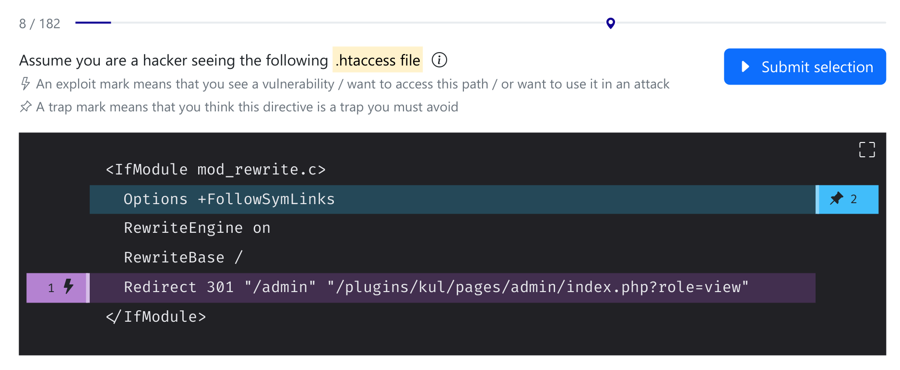

# Honeyquest Dataset v1.0

Artifact Version: July 27, 2024

## Game Description

The Honeyquest game asked participants to identify security vulnerabilities in web applications.
Honeyquest presented participants with realistic web application vignettes ("queries").
The design of the queries followed one of three strategies:

- **Neutral** queries may be harmless, secure, benign, well-protected, or of neutral appearance.
- **Risky** queries may be harmful, insecure, malicious, lack security measures, or have negative intent.
- **Deceptive** queries want to grab the attention of an adversary, often by seeming risky.

For each query, participants are asked to think like a hacker and tell us their next move:

- Participants can **continue** and do nothing.
- Participants can mark lines to **exploit** or mark them as a **traps** to avoid.
- Participants can indicate the order in which they would like to exploit something.

## Dataset Description

We provide five files:

- [`honeyquest_users.csv`](./honeyquest_users.csv): Participants' self-reported profile information. One participant per row.
- [`honeyquest_marks.csv`](./honeyquest_marks.csv): The individual exploit and trap marks placed by the participants. One mark per row.
- [`honeyquest_responses.csv`](./honeyquest_responses.csv): The answers given by participants to our queries. One answer per row.
- [`honeyquest_queries.csv`](./honeyquest_queries.csv): The queries (without payloads) that participants answered. One query per row.
- [`honeyquest_lines.csv`](./honeyquest_lines.csv): The individual query lines with the number of marks they received. One query line per row.

Note that participants are often referred to as users and responses are often referred to as answers.

## [`honeyquest_users.csv`](./honeyquest_users.csv)

Each row in this dataset represents one participant.

The phase in which a participant participated in can be identified by the `first_seen` column.
The first phase (23 participants in February 2023) can be identified by the year 2023 in this field.
The second phase (24 participants in January 2024) can be identified by the year 2024 in this field.

| Column      | Description                                                                                    |
| ----------- | ---------------------------------------------------------------------------------------------- |
| eid         | ID of the experiment, i.e., `ex1` for security professionals or `ctf1` for CTF players         |
| uid         | ID of the user (globally-unique)                                                               |
| job         | Job description, i.e., one of `student`, `dev`, `ops`, `secops`, `biz`, `research`, or `other` |
| years       | Years of professional experience in the field of cyber security                                |
| rank        | Skill level, i.e., one of `none`, `little`, `good`, `advanced`, or `expert`                    |
| color       | Favorite color of participant, encoded as a hex code                                           |
| first_seen  | Timestamp of the first response of this user                                                   |
| last_seen   | Timestamp of the last response of this user                                                    |
| num_answers | Total number of answered queries of this user (excluding tutorial queries)                     |

## [`honeyquest_marks.csv`](./honeyquest_marks.csv)

Each row in this dataset is a mark that was placed by a participant on a query line.

Note that participants were free to place multiple marks in a single response.
Please also note that this dataframe cannot encode responses in which participants skipped a query without placing any marks.
Instead, if you want to analyze complete responses to queries, refer to the response-based dataframe and possibly match on the `rid` field.

This dataframe is useful for mark-based analysis, i.e., if you need to know which lines a participant marked.

| Column           | Description                                                                                            |
| ---------------- | ------------------------------------------------------------------------------------------------------ |
| mid              | ID for an individual mark (part of a response) that a user placed on a query                           |
| eid              | ID of the experiment, i.e., `ex1` for security professionals or `ctf1` for CTF players                 |
| uid              | ID of the user that placed the mark (globally-unique)                                                  |
| rid              | ID of the associated response (which is composed of multiple answer marks) that a user submitted       |
| qid              | ID of the associated query that received those marks                                                   |
| query_label      | Associated query label, one of `neutral`, `deceptive`, or `risky`                                      |
| query_type       | Associated query type, one of `filesystem`, `htaccess`, `httpheaders`, or `networkrequests`            |
| answer_time      | Timestamp when the associated response was submitted                                                   |
| response_time    | Time in seconds that it took the user to submit the associated response                                |
| answer_rank      | Index of that mark in the associated response, i.e., the ordered rank (starts at 0)                    |
| answer_line      | Index of the line (in the query) that this mark was placed on (starts at 1)                            |
| answer_type      | `hack` for exploit marks and `trap` for trap marks                                                     |
| mrk_neutral      | `True` if this indicates a neutral mark, i.e., the user placed no marks (pseudo entry, always `False`) |
| mrk_hack         | `True` if this is an exploit mark, i.e., if the `answer_type` is `hack`                                |
| mrk_trap         | `True` if this is a trap mark, i.e., if the `answer_type` is `trap`                                    |
| mrk_line         | The associated query line text on which this marked was placed                                         |
| mrk_on_dcpt      | `True` if the mark was placed on a deceptive line in the associated query                              |
| mrk_on_risk      | `True` if the mark was placed on a risky line in the associated query                                  |
| mrk_hack_on_risk | `True` if this is an exploit mark that was placed on a risky line in the associated query              |
| mrk_hack_on_dcpt | `True` if this is an exploit mark that was placed on a deceptive line in the associated query          |
| mrk_trap_on_risk | `True` if this is a trap mark that was placed on a risky line in the associated query                  |
| mrk_trap_on_dcpt | `True` if this is a trap mark that was placed on a deceptive line in the associated query              |

## [`honeyquest_responses.csv`](./honeyquest_responses.csv)

Each row in this dataset is a response (i.e., an answer) submitted by a participant to a query.

Note that participants were free to place multiple marks in a single response.
If you want to analyze individual marks instead, refer to the mark-based dataframe and possibly match on the `rid` field.

This dataframe is useful for response-based analysis, i.e., if you need complete answers to queries.

| Column                 | Description                                                                           |
| ---------------------- | ------------------------------------------------------------------------------------- |
| rid                    | ID for a response (that is composed of answer marks) that a user submitted to a query |
| ans_all                | `True` if the user marked every single line                                           |
| ans_all_hack           | `True` if the user marked every single line with an exploit mark                      |
| ans_all_trap           | `True` if the user marked every single line with a trap mark                          |
| ans_any                | `True` if the user placed at least one exploit or trap mark anywhere                  |
| ans_any_hack           | `True` if the user placed at least one exploit mark anywhere                          |
| ans_any_trap           | `True` if the user placed at least one trap mark anywhere                             |
| ans_hack_on_risk_var   | The variant on how the exploit marks intersects with the risky lines (see below)      |
| ans_hack_on_risk       | `True` if the exploit marks intersect the risky lines                                 |
| ans_hack_on_dcpt_var   | The variant on how the exploit marks intersects with the deceptive lines (see below)  |
| ans_hack_on_dcpt       | `True` if the exploit marks intersect the deceptive lines                             |
| ans_trap_on_risk_var   | The variant on how the trap marks intersects with the risky lines (see below)         |
| ans_trap_on_risk       | `True` if the trap marks intersect the risky lines                                    |
| ans_trap_on_dcpt_var   | The variant on how the trap marks intersects with the deceptive lines (see below)     |
| ans_trap_on_dcpt       | `True` if the trap marks intersect the deceptive lines                                |
| ans_any_on_risk        | `True` if the user placed at least one exploit or trap mark on a risky line           |
| ans_any_on_dcpt        | `True` if the user placed at least one exploit or trap mark on a deceptive line       |
| ans_deceived_ranks     | The ranks of the exploit marks that were placed on deceptive lines                    |
| ans_not_deceived_ranks | The ranks of the exploit marks that were placed on non-deceptive lines                |
| ans_deceived_first     | `True` if the first exploit mark was placed on a deceptive line, `False` otherwise    |
| ans_hacked_ranks       | The ranks of the exploit marks that were placed on risky lines                        |
| ans_not_hacked_ranks   | The ranks of the exploit marks that were placed on non-risky lines                    |
| ans_hacked_first       | `True` if the first exploit mark was placed on a risky line, `False` otherwise        |

The `_var` columns hold the specific intersection variant that is explained in the appendix of our paper:

- `exact` (A1) marked line annotations exactly
- `subset` (A2) marked only some line annotations
- `overlap` (A3) marks only overlap line annotations
- `other` (A4) marked only lines that are not in the line annotations
- `none` (A5) no marks, despite non-empty line annotations

## [`honeyquest_queries.csv`](./honeyquest_queries.csv)

Each row in this dataset is a query that was presented to a user.

This dataframe is useful as a reference for the queries that we used in our experiment.
Note that our open-source repository (linked at the bottom) also contains all queries with full metadata information.

| Column                | Description                                                                            |
| --------------------- | -------------------------------------------------------------------------------------- |
| qid                   | ID for a query                                                                         |
| query_label           | Query label, one of `neutral`, `deceptive`, or `risky`                                 |
| query_type            | Query type, one of `filesystem`, `htaccess`, `httpheaders`, or `networkrequests`       |
| original_query        | If this is a patched query, the reference to its original                              |
| original_risky        | `True` if the original query was risky                                                 |
| applied_honeywire     | The name of the applied CDT, if one has been applied                                   |
| risk_type             | The risk type for risky queries, i.e., one of `weakness`, `vulnerability`, or `attack` |
| present_vulnerability | The name of the vulnerability, if one is present                                       |
| present_weakness      | The name of the weakness, if one is present                                            |
| present_attack        | The name of the attack, if one is present                                              |
| present_risk          | The name of any risk (vulnerability, weakness, or attack), if one of them is present   |
| num_risky_lines       | The number of risky lines in this query                                                |
| num_deceptive_lines   | The number of deceptive lines in this query                                            |
| num_lines             | The total number of lines in the query payload                                         |

## [`honeyquest_lines.csv`](./honeyquest_lines.csv)

Each row in this dataset is a query line that received at least one exploit or trap mark during the experiment.

This dataframe is useful for query line-based analysis, i.e., if you need to know the mark statistics for individual query lines.

| Column            | Description                                                                                                  |
| ----------------- | ------------------------------------------------------------------------------------------------------------ |
| mrk_line          | The associated query line text that received at least one mark                                               |
| mrk_on_dcpt       | The number of marks that this line received, if this line is deceptive                                       |
| mrk_on_risk       | The number of marks that this line received, if this line is risky                                           |
| mrk_hack_on_dcpt  | The number of expoit marks this line received, if this line is deceptive                                     |
| mrk_trap_on_dcpt  | The number of trap marks this line received, if this line is deceptive                                       |
| mrk_hack_on_risk  | The number of exploit marks this line received, if this line is risky                                        |
| mrk_trap_on_risk  | The number of trap marks this line received, if this line is risky                                           |
| mrk_hack          | The number of exploit marks this line received                                                               |
| mrk_trap          | The number of trap marks this line received                                                                  |
| mrk_neutral       | The number of neutral marks (i.e., no marks) this line received (pseudo entry, always zero)                  |
| mrk_query_type    | Associated query type, one of `filesystem`, `htaccess`, `httpheaders`, or `networkrequests`                  |
| applied_honeywire | The name of the applied CDT in the associated query, if one has been applied                                 |
| present_risk      | The name of any risk in the associated query (vulnerability, weakness, or attack), if one of them is present |

## ⚖️ License and Attribution

### Creative Commons Attribution International 4.0 License (CC BY 4.0)

<https://creativecommons.org/licenses/by/4.0/>

- You are free to **share** — copy and redistribute the material in any medium or format for any purpose, even commercially.
- You are free to **adapt** — remix, transform, and build upon the material for any purpose, even commercially.

The licensor cannot revoke these freedoms as long as you follow the license terms.

Under the following terms:

- **Attribution** — You must give appropriate credit, provide a link to the license, and indicate if changes were made. You may do so in any reasonable manner, but not in any way that suggests the licensor endorses you or your use.
- **No additional restrictions** — You may not apply legal terms or technological measures that legally restrict others from doing anything the license permits.

If you use this dataset please cite the following work, which also describes the experimental setup:

> Mario Kahlhofer, Stefan Achleitner, Stefan Rass, and René Mayrhofer. 2024.
> Honeyquest: Rapidly Measuring the Enticingness of Cyber Deception Techniques with Code-based Questionnaires.
> In The 27th International Symposium on Research in Attacks, Intrusions and Defenses (RAID 2024),
> September 30-October 02, 2024, Padua, Italy. ACM, New York, NY, USA, 20 pages.
> <https://doi.org/10.1145/3678890.3678897>

If you want to design or run your own studies, you can find the latest version of the Honeyquest tool on GitHub:

- <https://github.com/dynatrace-oss/honeyquest>
